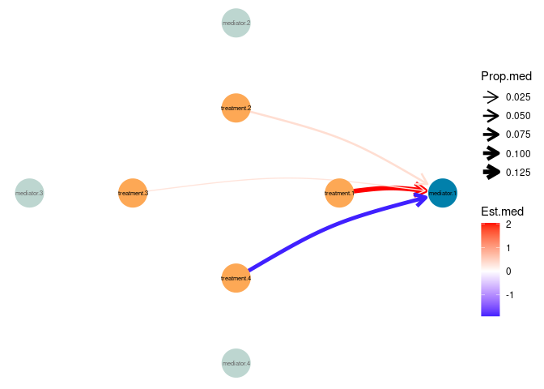
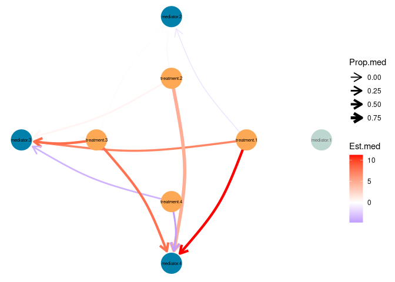

<!-- README.md is generated from README.Rmd. Please edit that file -->

# hightmed

``` r
library(hightmed)
library(survival)
library(dplyr) #
library(ggraph) #
```

In this tutorial, we will use all the functions available in `hightmed`
package to illustrate an example of how high-throughput mediation
analysis could be performed. To do so, we will make use of a dataframe
that contains information of 98 mice that have died between week 26 and
week 138 (this information is stored in a column called `age_death`).
The dataframe also contains several columns indicating the sex of the
mice (`gender`), and the measures of different treatments and mediators
collected in a continuous form. There is an additional column (`HF`),
that differentiates between mice that have died as a result of heart
failure or not, 1 or 0, respectively.

``` r
data("df", package = "hightmed")
```

With this data, we hypothesize that some treatments could be responsible
of the heart failure observed in the mice, and that some mediators could
explain the underlying mechanism of the relationship between the
treatment and heart failure.

Therefore, we are interested in testing the association between each
treatment and heart failure, trought each mediator. The `models_surv`
dataframe contains the `model.M` and `model.Y` formulas needed for each
mediation analysis.

``` r
data("models_surv", package = "hightmed")
```

Using the `generating_models()` function, we will generate the fitted
models for the mediator and the outcome, for each group of mediator,
treatment and outcome that we want to analyse. This function can be
executed iteratively to generate both groups of fitted models.

``` r
# fitted models for the mediator
medANDtreat <- generating_models(
    column.models='model.m.formula'
  , model.type=lm
  , data=df
  , data.models=models_surv
  , model.m = TRUE
  ) 

# fitted models for the outcome
medANDtreat <- generating_models(
    column.models='model.y.formula'
  , model.type=survival::survreg
  , data=df
  , data.models=medANDtreat
  , model.m = FALSE
  ) 
```

The new dataframe will contain the same information than the
`models_surv` one, but with two additional columns: the fitted models
for the mediators and treatments, respectively.

To apply high-troughput mediation, we execute the `hightmed()` function
over this data. The output of this function will be a list of lists,
with as many elements as different outcomes are present in the data.
Each sublist will contain the results of the mediation analysis as
mediate objects.

``` r
med_results <- hightmed(
    data.models=medANDtreat
  , column.modelm = 'model.M'
  , column.modely = 'model.Y'
  , treat='treatments'
  , mediator='mediators'
  , outcome='outcome'
  )

paste('Class of the mediation analysis results:', unlist(unique(lapply(med_results$outcome.1, function(x) {class(x)}))))
#> [1] "Class of the mediation analysis results: mediate"
```

As we can see in the previous slide, `hightmed()` generates objects of
class mediate. We need to transform this data to simplify it and make it
more user-friendly for the visualizations that will be performed later.
`formatting_med()` will generate a dataframe with the essential columns
needed for the visualizations. This function will also compute the
adjusted p-value over the analysis performed for each outcome and return
them to an additional column.

``` r
# formatting data
format_results <- formatting_med(med_results)
```

We can create a scatterplot for each outcome with the `visual_htmed()`
function. This will allow us to represent the relationship between the
treatments and mediators, being the size of the dot proportional to the
proportion of mediation, and the color, the estimation of mediation.

``` r
visual_outcome1_nosig <- visual_htmed(mediation.form = format_results, outcome = 'outcome.1')
#> pval.column argument not provided. Results without filtering data will be displayed
visual_outcome1_nosig
```


Another visualization can be done with `graph_htmed()` function. In the
default mode of this function, the graph will display the treatments as
the internal nodes, and the mediator as the external ones. Similar to
what `visual_htmed()` does, the width of the edges is proportional to
the proportion of mediation, and the color, to the estimation of
mediation.

``` r
graph_outcome1_nosig <- graph_htmed(mediation.form = format_results, outcome = 'outcome.1')
#> pval.column argument not provided. Results without filtering data will be displayed
graph_outcome1_nosig
```


We can also restrict our results, to display only significant results.
As `formatting_med()` computed the adjusted p-value, we can choose only
significant p-values based on it.

``` r
visual_outcome1_adj0.05 <- visual_htmed(
  mediation.form = format_results
  , outcome = 'outcome.1'
  , pval.column = 'adj.p-value.by_outcome'
  , pval = 0.05)
#> Results with adj.p-value.by_outcome <= 0.05 will be filtered out
visual_outcome1_adj0.05
#> Warning: Removed 11 rows containing missing values or values outside the scale range
#> (`geom_point()`).
```


``` r
graph_outcome1_adj0.05 <- graph_htmed(
  mediation.form = format_results
  , outcome = 'outcome.1'
  , pval.column = 'adj.p-value.by_outcome'
  , pval = 0.05)
#> Results with adj.p-value.by_outcome <= 0.05 will be filtered out
graph_outcome1_adj0.05
```


Now, imagine that we are interested in displaying the results in a
slightly different way: as mediators 2-4 are somehow related, we want to
visualize the analysis in which these mediators are involved separated
from the analyses performed with mediator.1. This can be done just by
adding an additional column to the `format_results` dataframe,
indicating how to group the data.

``` r
format_results$outcome.1 <- format_results$outcome.1 %>%
  mutate(clust = case_when(mediator == 'mediator.1' ~ 'mediator.1',
                           mediator != 'mediator.1' ~ 'other_med'))
```

``` r
visual_outcome1_split <- visual_htmed(
  mediation.form = format_results
  , outcome = 'outcome.1'
  , split = 'clust')
#> pval.column argument not provided. Results without filtering data will be displayed
visual_outcome1_split
```


``` r
graph_outcome1_split <- graph_htmed(
  mediation.form = format_results
  , outcome = 'outcome.1'
  , split = 'clust')
#> pval.column argument not provided. Results without filtering data will be displayed
```

``` r
# Results for mediator.1
graph_outcome1_split$mediator.1
```



``` r
# Results for other_med
graph_outcome1_split$other_med
```


