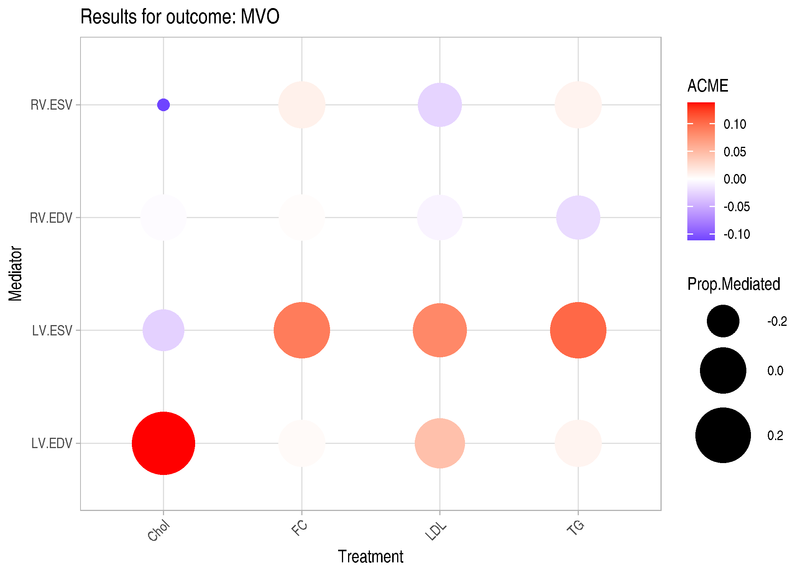
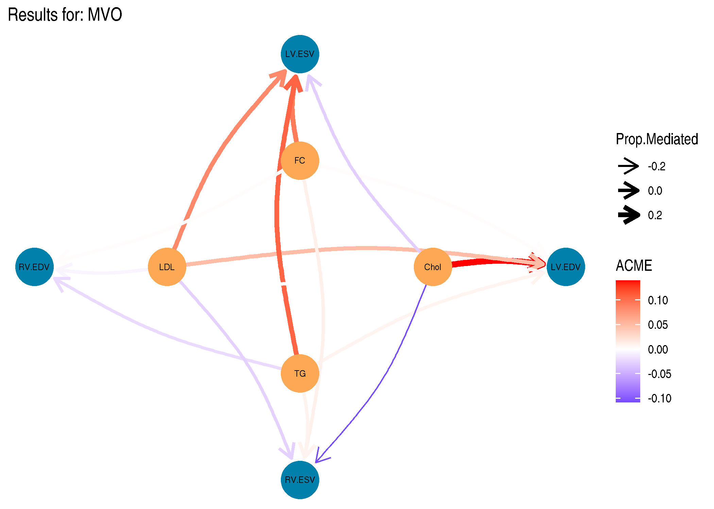
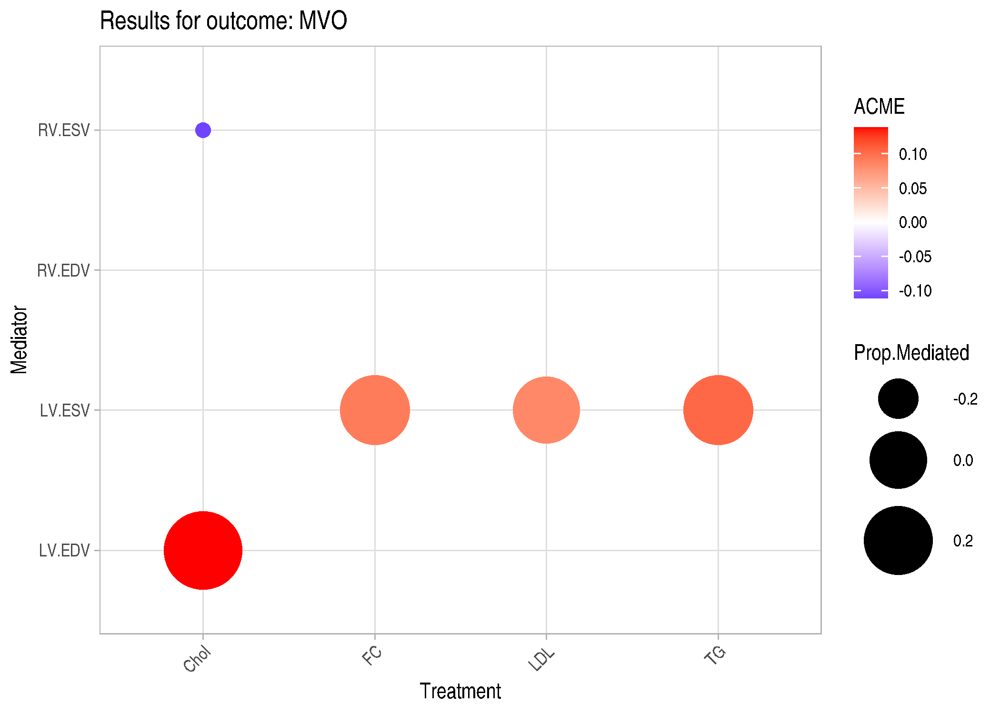
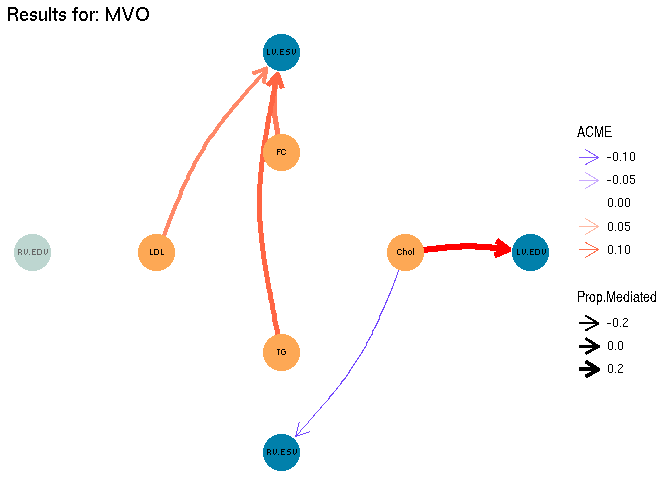
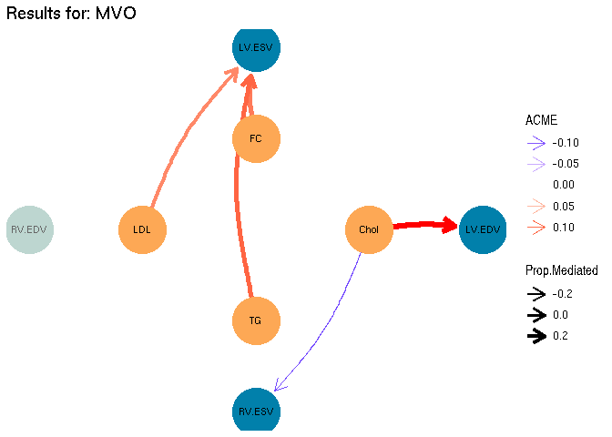
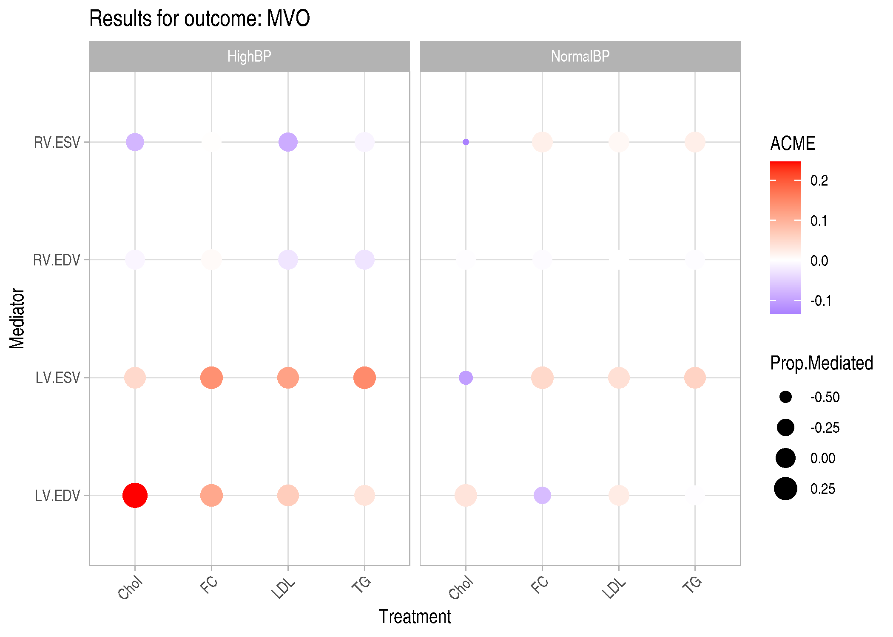
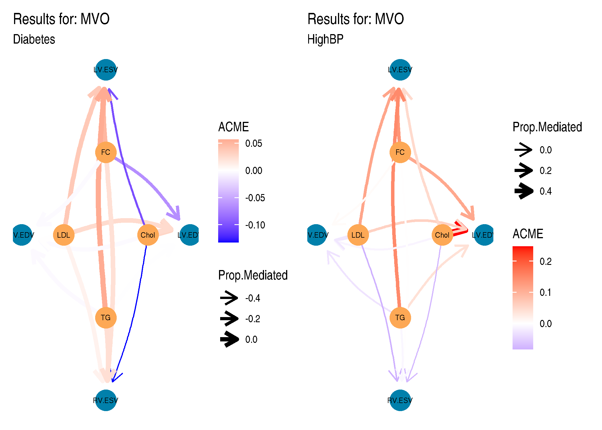

<!-- README.md is generated from README.Rmd. Please edit that file -->

# htmed

``` r
library(htmed)
#library(survival)
library(dplyr) 
library(ggraph)
```

In this tutorial, we will use all the functions available in `htmed`
package to illustrate an example of how high-throughput mediation
analysis could be performed.

## Data

To do so, we will simulate some data. Imagine that we have 100
individuals for which we have normalised measures of 4 biochemical
parameters: LDL, Chol, FC and TG. We also have information about
ventricle end-diastolic volume and end-systolic volume, in both right
and left ventricles. In this case, the data is binary, with 0 for
individuals with normal values, and 1 for individuals with ranges out of
normality. Finally, we have heart oxygen consumption information, also
normalised.

Our aim is to study the association between the biochemical parameters
(*treatments*) and the heart oxygen consumption (*outcome*). In
addition, we want to determine is any of the ventricle measures
(*mediators*) somehow explains the underlying mechanism of the
relationship between the treatments and the outcome.

``` r
set.seed(123)

n <- 100

# data for the mediators
df <- data.frame(
  LV.EDV = rbinom(n, 1, 0.5), 
  RV.EDV = rbinom(n, 1, 0.5), 
  LV.ESV = rbinom(n, 1, 0.5),  
  RV.ESV = rbinom(n, 1, 0.5)
)

# data for the treatment
df$LDL <- - 0.5 * df$LV.EDV + 0.3 * df$RV.EDV + 0.4 * df$LV.ESV + 0.6 * df$RV.ESV + rnorm(n)
df$Chol <- -0.6 * df$LV.EDV - 0.5 * df$RV.EDV - 0.4 * df$LV.ESV - 0.7 * df$RV.ESV + rnorm(n)
df$FC <- + df$LV.ESV + rnorm(n)
df$TG <- + 0.5 * df$RV.EDV + 0.8 * df$LV.ESV + rnorm(n)

# data for the outcome
df$MVO <- 1 - 1.2 * df$LV.EDV + 1.0 * df$LDL + 0.8 * df$Chol + 0.6 * df$FC + 0.9 * df$TG + rnorm(n)
df <- df %>% mutate(across(where(is.numeric), ~ as.numeric(scale(.))))
```

With this data, we hypothesize that some treatments could be responsible
of the values for the outcome observed in the individuals, and that some
mediators could explain the underlying mechanism of the relationship
between the treatment and the outcome.

Therefore, we are interested in testing the association between each
treatment and outcome, through each mediator. In order to perform this
mediation analyses, we first need to compute the fitted models for
mediators and outcomes, respectively, something that can be done with
the functions `mediator_models()` and `outome_models()`, respectively.
However, before applying this function, we need to generate a new
DataFrame in which we will specify what combination of treatment,
mediator and outcome we want to test. The DataFrame (called `models` in
this example), will be composed of as many rows as different analyses we
want to perform and five different columns:

  - outcome (character): the different outcomes that we are interested
    in predict. In this example we will work with just one outcome.
  - treatment (character): the different treatments to test.
  - mediator (character): the different mediators to test.
  - model.m.formula (character): it will inform about the formula that
    needs to be applied to compute the fitted models for mediator.
  - model.y.formula (character): analog to model.m.formula but with the
    formulas for the fitted models for outcome.

As you can see, we will use the `data_models()` function to generate
this DataFrame. By default, this function makes all possible
combinations of the supplied vectors for outcome, treatment and
mediator. If the user is interested in compute just some specific
models, we recommend to build a DataFrame following the five-column
structure of `models`.

``` r
# data("models_surv", package = "htmed")
outcome <- 'MVO'
treatment <- c('LDL', 'Chol', 'FC', 'TG')
mediator <- c('LV.EDV', 'RV.EDV', 'LV.ESV', 'RV.ESV')
    
models <- data_models(outcome = outcome, mediator = mediator, treatment = treatment)
```

## Simple usage

### Generatting models for mediators and outcomes

After generating `models`, we have all the necessary to apply the
`mediator_models()` and `outome_models()` functions. By applying them,
we will generate the fitted models for mediators and outcomes, for each
combination of mediator, treatment and outcome, in an iterative manner.
Both functions contain 6 arguments, being mandatory 5 of them:

  - `column.models` (character): the name of the column that contains
    the model formulas in `data.models`
  - `model.type` (function): the statistical analysis we are interested
    in applying over the data
  - `data` (dataframe): the DataFrame with the values
  - `data.models` (dataframe): the DataFrame with the models to perform
  - `model.name` (character): the name of the new column that will
    contain the fitted models for the mediator or outcome (depending on
    the function we are applying)

There are other 2 optional arguments: `outcome` will refer to the column
from the `data.models` DataFrame that contains the information of the
outcomes. Although this last argument is optional and does not need to
be specified if we have just one outcome, it is highly recommended if
you are dealing with more than one dependent variables. The
`data.split()` argument will be explained later.

Both functions also accept additional arguments (`...`) that are passed
directly to the model function specified in `model.type`. This is useful
when the chosen model requires extra parameters — for example, passing
`family = binomial()` when using `glm` for logistic regression.

``` r
# fitted models for the mediator
medANDout <- mediator_models(
    column.models='model.m.formula'
  , model.type=lm
  , data=df
  , data.models=models
  , model.name = 'model.M'
  ) 

# fitted models for the outcome
medANDout <- outcome_models(
    column.models='model.y.formula'
  , model.type=lm
  , data=df
  , data.models=medANDout
  , model.name = 'model.Y'
  ) 
```

The new dataframe will contain the same information than `models`, but
with two additional columns:

  - model.M: fitted models for mediators
  - model.Y: fitted models for outcomes

### High-throughput mediation analysis

To apply high-throughput mediation, we execute the `htmed()` function
over this data. From this point, we will just work with the DataFrame
generated in the previous step `medANDout`. `htmed()` requires the
following arguments:

  - data.models (dataframe): object with the fitted models for mediators
    and outcomes.
  - column.modelm and column.modely (characters): these arguments refer
    to the columns from `data.models` that contain the fitted models for
    mediator and outcomes, respectively.
  - treat, mediator and outcome (characters): these three arguments
    refer to the columns from `data.models` with the treatment, mediator
    and outcome information, respectively.
  - data.split (character): will be explained later.

There is an additional argument `seed` that can be introduced to ensure
reproducibility of results.

`htmed()` also accepts additional arguments (`...`) that are passed
directly to `mediation::mediate()`. This is useful when the mediation
model requires specific control options — for example, `control.value`
and `treat.value` to define the reference levels of a non-binary
treatment.

``` r
med_results <- htmed(
    data.models=medANDout
  , column.modelm = 'model.M'
  , column.modely = 'model.Y'
  , treat='treatment'
  , mediator='mediator'
  , outcome='outcome'
  )
```

``` r
# med_results %>% View(.)

# Class of the mediation analysis results:
unlist(unique(lapply(med_results$MVO, function(x) {class(x)})))
#> [1] "mediate"
```

`htmed()` will generate a list of lists in which the first level will be
the different outcomes tested (one in this example), and the second
level, the mediation analyses performed.

``` r
# Outcomes tested
names(med_results)
#> [1] "MVO"

# Analyses performed for MVO
names(med_results$MVO)
#>  [1] "`LV.EDV` ~ `Chol`" "`LV.EDV` ~ `FC`"   "`LV.EDV` ~ `LDL`" 
#>  [4] "`LV.EDV` ~ `TG`"   "`LV.ESV` ~ `Chol`" "`LV.ESV` ~ `FC`"  
#>  [7] "`LV.ESV` ~ `LDL`"  "`LV.ESV` ~ `TG`"   "`RV.EDV` ~ `Chol`"
#> [10] "`RV.EDV` ~ `FC`"   "`RV.EDV` ~ `LDL`"  "`RV.EDV` ~ `TG`"  
#> [13] "`RV.ESV` ~ `Chol`" "`RV.ESV` ~ `FC`"   "`RV.ESV` ~ `LDL`" 
#> [16] "`RV.ESV` ~ `TG`"
```

### Formatting the mediation results

If we explore the results, we will see that the output is in some way
difficult to understand.

``` r
# med_results$MVO['`LV.EDV` ~ `Chol`'] 
```

We need to transform this data to simplify and make it more
user-friendly for the visualizations that will be performed later. Using
`format_med()` with just `med_results` as input, we will generate a
DataFrame with the essential columns needed for the visualizations.

`format_med()` has an `estimate` argument that controls which estimate
is reported when the mediation model has a control/treated split. It
accepts `"average"` (default), `"control"`, or `"treated"`. For models
without a split, this argument is ignored.

This function also computes two different kinds of adjusted p-value:
adj.pval.PropMed.by\_outcome and adj.pval.PropMed.all. The difference
between both results is that, while the first one adjusts by each of the
outcomes, the second adjusted p-value takes into account all the
analyses from all the outcomes. The usage of one or the other will
depend on the question that the investigator wants to answer.

``` r
# formatting data
format_results <- format_med(mediation.list = med_results)
```

### Visualization

Finally, we will be interested in visualise our results. The package has
two available functions for this purposse.

We can create a scatterplot for each outcome with the `scatter_htmed()`
function. Run in the default model, just with the mandatory arguments,
we will need to specify:

  - mediation\_form (lists of lists): the object that contain the
    results.
  - outcome (characters): the outcome the user is interested in
    visualising.

<!-- end list -->

``` r
visual_outcome1_nosig <- scatter_htmed(mediation.form = format_results, outcome = 'MVO', size_dot = 3)
#> pval.column argument not provided. Results without filtering data will be displayed
visual_outcome1_nosig
```


This scatterplot will represents, for MVO, the relationship between the
treatments and mediators, being the size of the dot proportional to the
proportion of mediation, and the color, the estimation of mediation.

Another visualization can be done with `graph_htmed()` function. In the
default mode of this function, the graph will display the treatments as
the internal nodes, and the mediator as the external ones. Similar to
what `scatter_htmed()` does, the width of the edges is proportional to
the proportion of mediation, and the color, to the estimation of
mediation.

``` r
graph_outcome1_nosig <- graph_htmed(mediation.form = format_results, outcome = 'MVO')
#> pval.column argument not provided. Results without filtering data will be displayed
graph_outcome1_nosig
```



You might have notice that we have not filtered out any mediation
analyses in the representation, which means that all results,
independently of the level of significance, are visualized. This is what
occurs by default in both `scatter_htmed()` and `graph_htmed()`
functions.

Nevertheless, you can filter the data by specifying the level of
significance (`pval`) and the column to apply it (`pval.column`). In the
following chunks, we will restrict our representation to mediation
analyses with an p-value \<= 0.05.

``` r
visual_outcome1_adj0.05 <- scatter_htmed(
  mediation.form = format_results
  , outcome = 'MVO'
  , pval.column = "pval.PropMed"
  , pval = 0.05
  , size_dot = 3)
#> Results with pval.PropMed <= 0.05 will be filtered out
visual_outcome1_adj0.05
#> Warning: Removed 11 rows containing missing values or values outside the scale range
#> (`geom_point()`).
```



``` r
graph_outcome1_adj0.05 <- graph_htmed(
  mediation.form = format_results
  , outcome = 'MVO'
  , pval.column = "pval.PropMed"
  , pval = 0.05)
#> Results with pval.PropMed <= 0.05 will be filtered out
graph_outcome1_adj0.05
```



Additionally, `grapg_htmed()` allows you to custom some visualization
parameters such as the size of the node, the size of the node names and
the end of the arrows, as it will be shown in the next chunk.

``` r
graph_htmed(
    mediation.form = format_results
  , outcome = 'MVO'
  , pval.column = "pval.PropMed"
  , pval = 0.05
  , size_node = 1.5
  , size_name = 1.3
  , end_arrow = 4)
#> Results with pval.PropMed <= 0.05 will be filtered out
```



## Splitting the data

Now, we will include a new column to the original DataFrame, to classify
individuals depending on their comorbidity.

``` r
df <- df %>% 
  mutate(split = sample(x = c('HighBP', 'NormalBP'), size = 100, replace = TRUE))

df %>% dplyr::select(split) %>% table(.)
#> split
#>   HighBP NormalBP 
#>       53       47
```

Under the previous hypothesis, we were perfoming the analyses with the
individuals as a whole. Nevertheless, we now think that the underlying
mechanisms that leads to the outcome could differ depending on the
condition observed in the individuals. `htmed` package allows to take
this into account by some additional arguments present in the functions
available.

### Generating models for mediators and outcomes

Therefore, we will execute `mediator_models()` `outcome_models()` and
iteratively to generate both fitted outcomes for mediator and outcome,
by adding `data.split` argument. This will indicate the column from `df`
that has the information to split with.

``` r
# fitted models for the mediator
medANDout.split <- mediator_models(
    column.models='model.m.formula'
  , model.type=lm
  , data=df
  , data.models=models
  , model.name = 'model.M'
  , data.split = 'split'
  ) 
#> Performing fitted models for mediators
#> Number of cores that will be used: 21

# fitted models for the outcome
medANDout.split <- outcome_models(
    column.models='model.y.formula'
  , model.type=lm
  , data=df
  , data.models=medANDout.split
  , model.name = 'model.Y'
  , data.split = 'split'
  ) 
#> Performing fitted models for outcomes
#> Number of cores that will be used: 21
```

Comparing this new DataFrame (`medANDout.split`) with the one in which
split was not applied (`medANDout`), we will notice that the new one
doubles the dimension of the second one. This is because the fitted
models have been performed independently for each condition.

``` r
dim(medANDout.split)
#> [1] 32  8

dim(medANDout)
#> [1] 16  7
```

### High-throughput mediation analysis

To perform the mediation analyses, we will add the same argument
(`data.split`).

``` r
med_results.split <- htmed(
    data.models=medANDout.split
  , column.modelm = 'model.M'
  , column.modely = 'model.Y'
  , treat='treatment'
  , mediator='mediator'
  , outcome='outcome'
  , data.split = 'split'
  )
```

This new object will have three levels of lists. The first will be the
outcomes tested, whereas the second one will be the conditions used to
split. The third will be the different mediation analyses.

``` r
# Outcomes tested
names(med_results.split)
#> [1] "MVO"

# Conditions
names(med_results.split$MVO)
#> [1] "NormalBP" "HighBP"

# Analyses for NormalBP
names(med_results.split$MVO$NormalBP)
#>  [1] "`LV.EDV` ~ `Chol`" "`LV.EDV` ~ `FC`"   "`LV.EDV` ~ `LDL`" 
#>  [4] "`LV.EDV` ~ `TG`"   "`LV.ESV` ~ `Chol`" "`LV.ESV` ~ `FC`"  
#>  [7] "`LV.ESV` ~ `LDL`"  "`LV.ESV` ~ `TG`"   "`RV.EDV` ~ `Chol`"
#> [10] "`RV.EDV` ~ `FC`"   "`RV.EDV` ~ `LDL`"  "`RV.EDV` ~ `TG`"  
#> [13] "`RV.ESV` ~ `Chol`" "`RV.ESV` ~ `FC`"   "`RV.ESV` ~ `LDL`" 
#> [16] "`RV.ESV` ~ `TG`"
```

### Formatting the mediation results

When we are dealing with splitted data, we need to explicit it to the
`format_med()` function to format the data right. This will be done by
setting to TRUE the `split` argument.

``` r
format_results.split <- format_med(med_results.split, split = TRUE)
```

### Visualization

``` r
visual_outcome1_nosig.split <- scatter_htmed(
    mediation.form = format_results.split
  , outcome = 'MVO'
  , data.split = 'split')
#> pval.column argument not provided. Results without filtering data will be displayed
visual_outcome1_nosig.split
```



In this case, two scatterplots will be displayed, differenciating
between the analyses from the two initial conditions (NormalBP and
HighBP).

``` r
graph_outcome1_nosig.split <- graph_htmed(
    mediation.form = format_results.split
  , outcome = 'MVO'
  , size_node = 0.65
  , data.split = 'split')
#> pval.column argument not provided. Results without filtering data will be displayed

library(patchwork)
graph_outcome1_nosig.split$NormalBP | graph_outcome1_nosig.split$HighBP
```


The same occurs when applying `graph_htmed()` ; two graph are generated,
depending on the condition studied.
