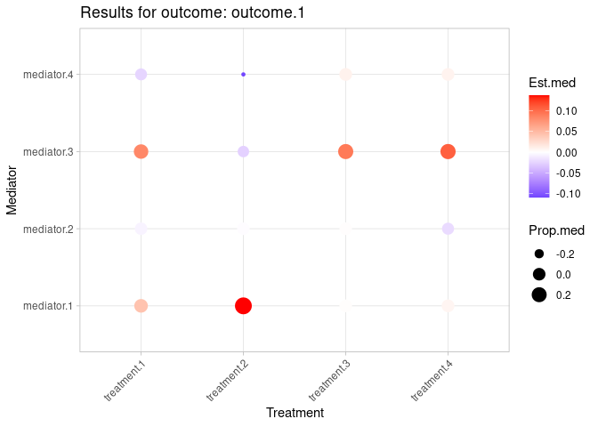
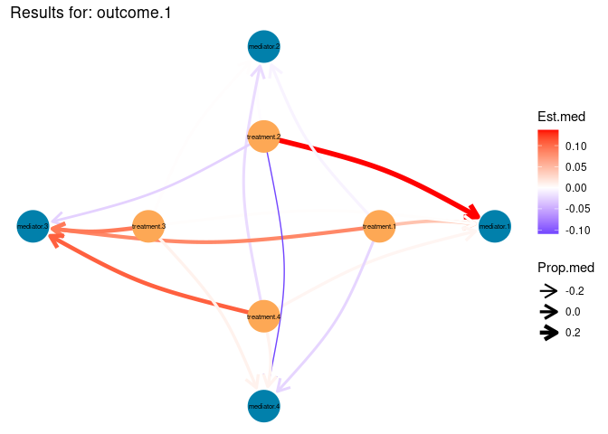
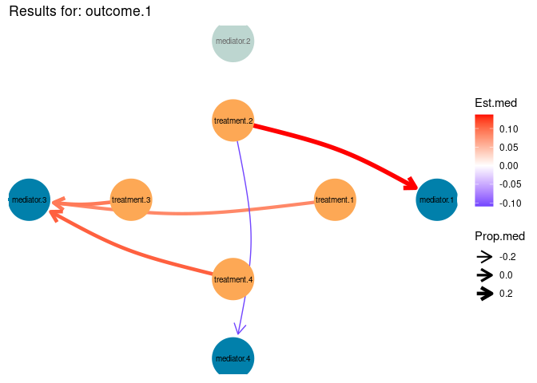
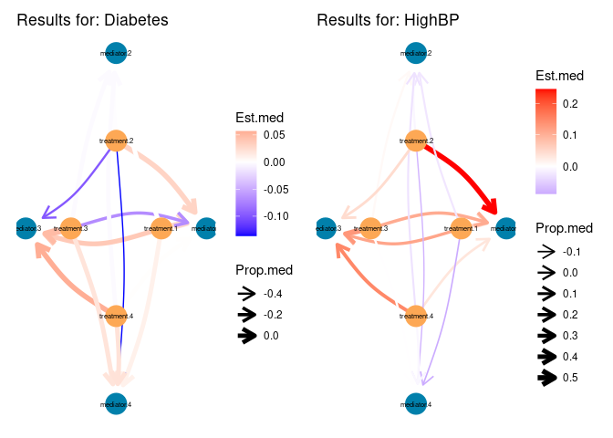

<!-- README.md is generated from README.Rmd. Please edit that file -->

# htmed

``` r
library(htmed)
library(survival)
library(dplyr) #
library(ggraph) #
```

In this tutorial, we will use all the functions available in `htmed`
package to illustrate an example of how high-throughput mediation
analysis could be performed.

## Data

To do so, we will simulate some data. Imagine that we have 100
individuals for which we have measured 4 different treatments (binary),
4 different mediators (continuous) and a single outcome (continuous).

``` r
set.seed(123)

n <- 100

# data for the treatments
df <- data.frame(
  treatment.1 = rbinom(n, 1, 0.5), 
  treatment.2 = rbinom(n, 1, 0.5), 
  treatment.3 = rbinom(n, 1, 0.5),  
  treatment.4 = rbinom(n, 1, 0.5),
  outcome.1 = rnorm(n)
)

# data for the mediators
df$mediator.1 <- - 0.5 * df$treatment.1 + 0.3 * df$treatment.2 + 0.4 * df$treatment.3 + 0.6 * df$treatment.4 + rnorm(n)
df$mediator.2 <- -0.6 * df$treatment.1 - 0.5 * df$treatment.2 - 0.4 * df$treatment.3 - 0.7 * df$treatment.4 + rnorm(n)
df$mediator.3 <- - 0.7 * df$treatment.2 - 0.2 * df$treatment.3 - 1 * df$treatment.4 + rnorm(n)
df$mediator.4 <- - 0.5 * df$treatment.2 - 0.3 * df$treatment.3 - 0.2 * df$treatment.4 - rnorm(n)

# data for the outcome
df$outcome.1 <- 1 + 1.2 * df$mediator.1 + 1.0 * df$treatment.1 + 0.8 * df$treatment.2 + 0.6 * df$treatment.3 + 0.9 * df$treatment.4 + rnorm(n)
```

With this data, we hypothesize that some treatments could be responsible
of the values for the outcome observed in the individuals, and that some
mediators could explain the underlying mechanism of the relationship
between the treatment and the outcome.

Therefore, we are interested in testing the association between each
treatment and outcome, through each mediator. In order to perform this
mediation analyses, we first need to compute the fitted models for
mediators and outcomes, respectively, something that can be done with
`generatting_models()`. However, before applying this function, we need
to generate a new DataFrame in which we will specify what combination of
treatment, mediator and outcome we want to test. The DataFrame (called
`models` in this example), will be composed of as many rows as different
analyses we want to perform and five different columns:

-   outcome (characters): it contains the different outcomes that we are
    interested in predict. In this example we will work with just one
    outcome.
-   treatment (characters): column with the different treatments to
    test.
-   mediator (characters): column with the different mediators to test.
-   model.m.formula (characters): this column will inform about the
    formula that needs to be apply to compute the fitted models for
    mediator.
-   model.y.formula (characters): similar to model.m.formula but with
    the formulas for the fitted models for outcome.

As you can see, we will use the `data_models()` function to generate
this DataFrame. By default, this function makes all possible
combinations of the supplied vectors for outcome, treatment and
mediator. If the user is interested in compute just some specific
models, we recommend to build a DataFrame following the five-column
structure of `models`.

``` r
# data("models_surv", package = "htmed")
outcome <- 'outcome.1'
treatment <- paste('treatment', c(1, 2, 3, 4), sep='.')
mediator <- paste('mediator', c(1, 2, 3, 4), sep='.')
    
models <- data_models(outcome = outcome, mediator = mediator, treatment = treatment)
```

## Simple usage

### Generatting models for mediators and outcomes

After generating `models`, we have all the necessary to apply the
`generate_models()` function. With this function we will generate the
fitted models for mediators and outcomes, for each combination of
mediator, treatment and outcome, in an iterative manner.
`generate_models()` contains 6 arguments, being mandatory 4 of them: the
DataFrame with the values (`data`), the DataFrame with the models to
perform (`data.models`), the name of the column that contains the model
formulas in `data.models` (`column.models`) and the statistical analysis
we are interested in applying over the data (`model.type`). There are
other 3 optional arguments: `model.m` indicates if we are computing the
fitted models for mediators (TRUE) or for outcomes (FALSE), and
`outcome` will refer to the column from the `data.models` object that
contains the information of the outcomes. Although this last argument is
optional and does not need to be specified if we have just one outcome,
it is highly recommended if you are dealing with more than one dependent
variables. The `data.split()` argument will be explained later.

``` r
# fitted models for the mediator
medANDtreat <- generate_models(
    column.models='model.m.formula'
  , model.type=lm
  , data=df
  , data.models=models
  , model.m = TRUE
  ) 

# fitted models for the outcome
medANDtreat <- generate_models(
    column.models='model.y.formula'
  , model.type=lm
  , data=df
  , data.models=medANDtreat
  , model.m = FALSE
  ) 
```

The new dataframe will contain the same information than `models`, but
with two additional columns:

-   model.M: fitted models for mediators
-   model.Y: fitted models for outcomes

### High-throughput mediation analysis

To apply high-throughput mediation, we execute the `htmed()` function
over this data. From this point, we will just work with the DataFrame
generated in the previous step `medANDtreat`. `htmed()` requires the
following arguments:

-   data.models (dataframe): object with the fitted models for mediators
    and outcomes.
-   column.modelm and column.modely (characters): these arguments refer
    to the columns from `data.models` that contain the fitted models for
    mediator and outcomes, respectively.
-   treat, mediator and outcome (characters): these three arguments
    refer to the columns from `data.models` with the treatment, mediator
    and outcome information, respectively.
-   data.split (characters): will be explained later.

There is an additional argument `seed` that can be introduced to ensure
reproducibility of results.

``` r
med_results <- htmed(
    data.models=medANDtreat
  , column.modelm = 'model.M'
  , column.modely = 'model.Y'
  , treat='treatment'
  , mediator='mediator'
  , outcome='outcome'
  )
```

``` r
# med_results %>% View(.)

# Class of the mediation analysis results:
unlist(unique(lapply(med_results$outcome.1, function(x) {class(x)})))
#> [1] "mediate"
```

`htmed()` will generate a list of lists in which the first level will be
the different outcomes tested (one in this example), and the second
level, the mediation analyses performed.

``` r
# Outcomes tested
names(med_results)
#> [1] "outcome.1"

# Analyses performed for outcome.1
names(med_results$outcome.1)
#>  [1] "mediator.1 ~ treatment.1" "mediator.1 ~ treatment.2"
#>  [3] "mediator.1 ~ treatment.3" "mediator.1 ~ treatment.4"
#>  [5] "mediator.2 ~ treatment.1" "mediator.2 ~ treatment.2"
#>  [7] "mediator.2 ~ treatment.3" "mediator.2 ~ treatment.4"
#>  [9] "mediator.3 ~ treatment.1" "mediator.3 ~ treatment.2"
#> [11] "mediator.3 ~ treatment.3" "mediator.3 ~ treatment.4"
#> [13] "mediator.4 ~ treatment.1" "mediator.4 ~ treatment.2"
#> [15] "mediator.4 ~ treatment.3" "mediator.4 ~ treatment.4"
```

### Formatting the mediation results

If we explore the results, we will see that the output is in some way
difficult to understand.

``` r
# med_results$outcome.1$`mediator.1 ~ treatment.1` %>% View(.)
```

We need to transform this data to simplify and make it more
user-friendly for the visualizations that will be performed later. Using
`format_med()` with just `med_results` as input, we will generate a
DataFrame with the essential columns needed for the visualizations.

This function also computes two different kinds of adjusted p-value:
adj.p-value.by_outcome and adj.p-value.all. The difference between both
results is that, while the first one adjusts by each of the outcomes,
the second adjusted p-value takes into account all the analyses from all
the outcomes. The usage of one or the other will depend on the question
that the investigator wants to answer.

``` r
# formatting data
format_results <- format_med(med_results)
```

### Visualization

Finally, we will be interested in visualise our results. The package has
two available functions for this purposse.

We can create a scatterplot for each outcome with the `visual_htmed()`
function. Run in the default model, just with the mandatory arguments,
we will need to specify:

-   mediation_form (lists of lists): the object that contain the
    results.
-   outcome (characters): the outcome the user is interested in
    visualising.

``` r
visual_outcome1_nosig <- visual_htmed(mediation.form = format_results, outcome = 'outcome.1')
#> pval.column argument not provided. Results without filtering data will be displayed
visual_outcome1_nosig
```

 This
scatterplot will represents, for outcome.1, the relationship between the
treatments and mediators, being the size of the dot proportional to the
proportion of mediation, and the color, the estimation of mediation.

Another visualization can be done with `graph_htmed()` function. In the
default mode of this function, the graph will display the treatments as
the internal nodes, and the mediator as the external ones. Similar to
what `visual_htmed()` does, the width of the edges is proportional to
the proportion of mediation, and the color, to the estimation of
mediation.

``` r
graph_outcome1_nosig <- graph_htmed(mediation.form = format_results, outcome = 'outcome.1')
#> pval.column argument not provided. Results without filtering data will be displayed
graph_outcome1_nosig
```



You might have notice that we have not filtered out any mediation
analyses in the representation, which means that all results,
independently of the level of significance, are visualized. This is what
occurs by default in both `visual_htmed()` and `graph_htmed()`
functions.

Nevertheless, you can filter the data by specifying the level of
significance (`pval`) and the column to apply it (`pval.column`). In the
following chunks, we will restrict our representation to mediation
analyses with an p-value \<= 0.05.

``` r
visual_outcome1_adj0.05 <- visual_htmed(
  mediation.form = format_results
  , outcome = 'outcome.1'
  , pval.column = 'p-value_Prop._Mediated_(average)'
  , pval = 0.05)
#> Results with p-value_Prop._Mediated_(average) <= 0.05 will be filtered out
visual_outcome1_adj0.05
#> Warning: Removed 10 rows containing missing values or values outside the scale range
#> (`geom_point()`).
```


``` r
graph_outcome1_adj0.05 <- graph_htmed(
  mediation.form = format_results
  , outcome = 'outcome.1'
  , pval.column = 'p-value_Prop._Mediated_(average)'
  , pval = 0.05)
#> Results with p-value_Prop._Mediated_(average) <= 0.05 will be filtered out
graph_outcome1_adj0.05
```


Additionally, `grapg_htmed()` allows you to custom some visualization
parameters such as the size of the node, the size of the node names and
the end of the arrows, as it will be shown in the next chunk.

``` r
graph_htmed(
    mediation.form = format_results
  , outcome = 'outcome.1'
  , pval.column = 'p-value_Prop._Mediated_(average)'
  , pval = 0.05
  , size_node = 1.5
  , size_name = 1.3
  , end_arrow = 4)
#> Results with p-value_Prop._Mediated_(average) <= 0.05 will be filtered out
```



## Splitting the data

Now, we will include a new column to the original DataFrame, to classify
individuals depending on their comorbidity.

``` r
df <- df %>% 
  mutate(split = sample(x = c('HighBP', 'Diabetes'), size = 100, replace = TRUE))

df %>% dplyr::select(split) %>% table(.)
#> split
#> Diabetes   HighBP 
#>       45       55
```

Under the previous hypothesis, we were perfoming the analyses with the
individuals as a whole. Nevertheless, we now think that the underlying
mechanisms that leads to the outcome could differ depending on the
condition observed in the individuals. `htmed` package allows to take
this into account by some additional arguments present in the functions
available.

### Generating models for mediators and outcomes

Therefore, we will execute `generate_models()` iteratively to generate
both fitted outcomes for mediator and outcome, by adding `data.split`
argument. This will indicate the column from `df` that has the
information to split with.

``` r
# fitted models for the mediator
medANDtreat.split <- generate_models(
    column.models='model.m.formula'
  , model.type=lm
  , data=df
  , data.models=models
  , model.m = TRUE
  , data.split = 'split'
  ) 
#> Number of cores that will be used: 5
#> Performing fitted models for mediator

# fitted models for the outcome
medANDtreat.split <- generate_models(
    column.models='model.y.formula'
  , model.type=lm
  , data=df
  , data.models=medANDtreat.split
  , model.m = FALSE
  , data.split = 'split'
  ) 
#> Number of cores that will be used: 5
#> Performing fitted models for outcome
```

Comparing this new DataFrame (`medANDtreat.split`) with the one in which
split was not applied (`medANDtreat`), we will notice that the new one
doubles the dimension of the second one. This is because the fitted
models have been performed independently for each condition.

``` r
dim(medANDtreat.split)
#> [1] 32  8

dim(medANDtreat)
#> [1] 16  7
```

### High-throughput mediation analysis

To perform the mediation analyses, we will add the same argument
(`data.split`).

``` r
med_results.split <- htmed(
    data.models=medANDtreat.split
  , column.modelm = 'model.M'
  , column.modely = 'model.Y'
  , treat='treatment'
  , mediator='mediator'
  , outcome='outcome'
  , data.split = 'split'
  )
```

This new object will have three levels of lists. The first will be the
outcomes tested, whereas the second one will be the conditions used to
split. The third will be the different mediation analyses.

``` r
# Outcomes tested
names(med_results.split)
#> [1] "outcome.1"

# Conditions
names(med_results.split$outcome.1)
#> [1] "Diabetes" "HighBP"

# Analyses for Diabetes
names(med_results.split$outcome.1$Diabetes)
#>  [1] "mediator.1 ~ treatment.1" "mediator.1 ~ treatment.2"
#>  [3] "mediator.1 ~ treatment.3" "mediator.1 ~ treatment.4"
#>  [5] "mediator.2 ~ treatment.1" "mediator.2 ~ treatment.2"
#>  [7] "mediator.2 ~ treatment.3" "mediator.2 ~ treatment.4"
#>  [9] "mediator.3 ~ treatment.1" "mediator.3 ~ treatment.2"
#> [11] "mediator.3 ~ treatment.3" "mediator.3 ~ treatment.4"
#> [13] "mediator.4 ~ treatment.1" "mediator.4 ~ treatment.2"
#> [15] "mediator.4 ~ treatment.3" "mediator.4 ~ treatment.4"
```

### Formatting the mediation results

When we are dealing with splitted data, we need to explicit it to the
`format_med()` function to format the data right. This will be done by
setting to TRUE the `split` argument.

``` r
format_results.split <- format_med(med_results.split, split = TRUE)
```

### Visualization

``` r
visual_outcome1_nosig.split <- visual_htmed(
    mediation.form = format_results.split
  , outcome = 'outcome.1'
  , data.split = 'split')
#> pval.column argument not provided. Results without filtering data will be displayed
visual_outcome1_nosig.split
```


In this case, two scatterplots will be displayed, differenciating
between the analyses from the two initial conditions (Diabetes and High
Blood Pressure).

``` r
graph_outcome1_nosig.split <- graph_htmed(
    mediation.form = format_results.split
  , outcome = 'outcome.1'
  , size_node = 0.65
  , data.split = 'split')
#> pval.column argument not provided. Results without filtering data will be displayed

library(patchwork)
graph_outcome1_nosig.split$Diabetes + graph_outcome1_nosig.split$HighBP
```


The same occurs when applying `graph_htmed()` ; two graph are generated,
depending on the condition studied.
